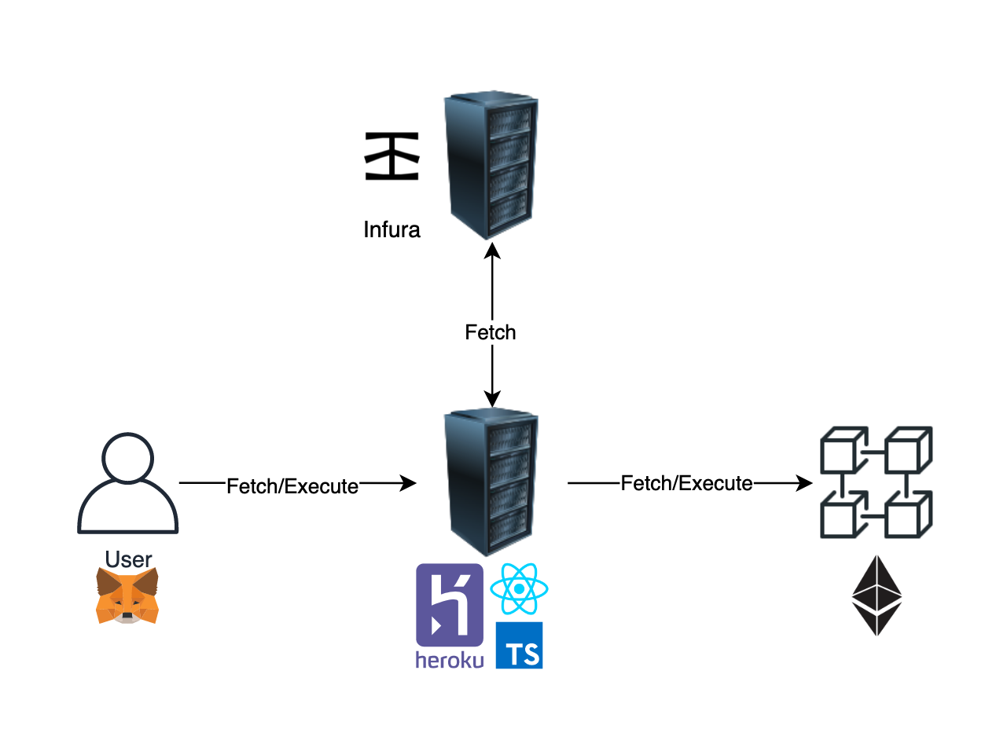
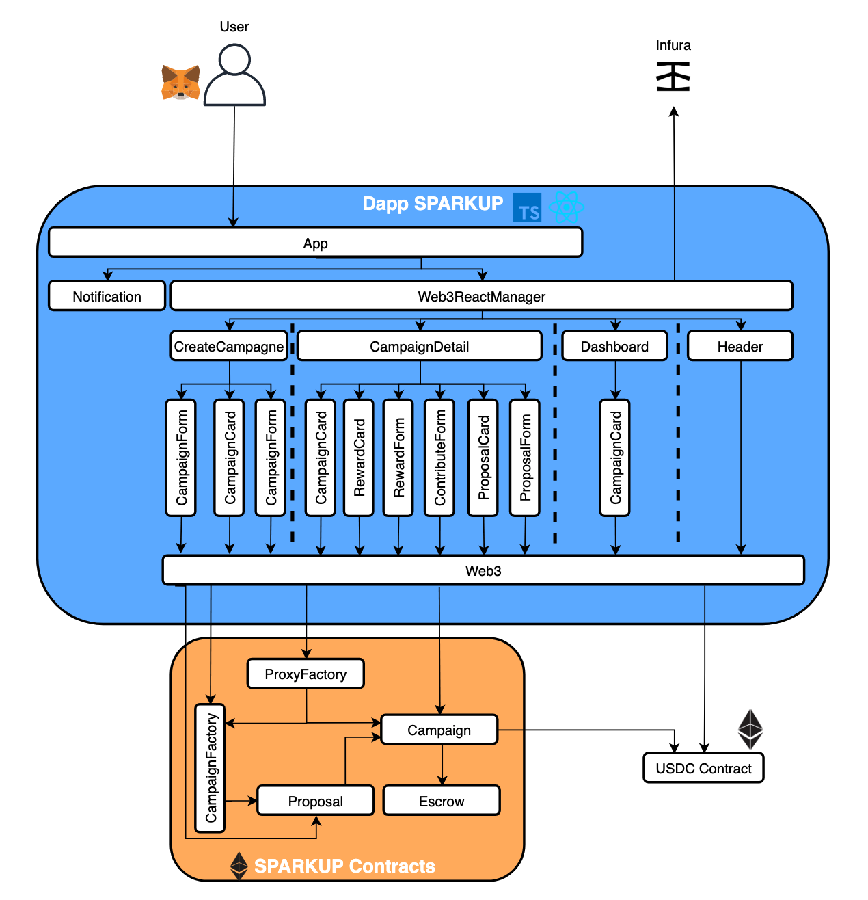

# SparkUp

[](https://coveralls.io/github/FabienCoutant/SparkUp?branch=master)

Alyra's 2021 Final Project.

## Contents

- [Concept](#concept)
- [Design pattern decisions](#Design-pattern-decisions)
- [Technical Specifications](#Technical-Specifications)
  - [Front end coding languages](#Front-end-coding-languages)
  - [Front end libraries](#Front-end-libraries)
  - [Back end coding language](#Back-end-coding-language)
  - [Framework](#Framework)
  - [Versioning](#Versioning)
  - [Code quality libraries](#Code-quality-libraries)
  - [Other libraries](#Other-libraries)
  - [Network](#Network)
- [Installation](#Installation)
- [Configuration](#Configuration)
  - [Environment Parameters](#Environment-Parameters)
    - [Back end](#Back-end-configuration)
    - [Front end](#Front-end-configuration)
  - [Deployment](#Deployment)
    - [Back end](#Back-end)
    - [Front end](#Front-end)
- [Tests](#Tests)
- [Avoiding common attacks](#Avoiding-common-attacks)
- [Events](#Events)
- [Contributors](#Contributors)

## Concept

**SparkUp** is a DApp with the goal of decentralizing crowdfunding along with improving its funding
process. We believe that contributors and creators must keep a link between them after the fundraising process is completed. To do so, we developed a
DApp that allows creators to create Campaigns that contributors can contribute to in USDC.

In the case of a **successful fundraising** :

- Each backer will get a **voting power which proportionally to their contribution**.
- To withdraw funds, the creator will have to create proposals (spending requests) and submit them to the campaign contributors in order to approve funding release.
- If more that 50% of contributors approve the proposal, than the campaign manager recieves the funds.

In case of a **unsuccessful fundraising** :

- Each contributor is authorized to withdraw its initial contribution

## Design pattern decisions

You can find all of the design patter details [here](./docs/DESIGN_PATTERN_DECISIONS.md)

## Technical Specifications

This partsections lists the main development languages and libraries used along with the project architecture :

### Architecture

|  |
| :--------------------------------------------------------------: |
|              <b>Fig.1 - High Level Architecture</b>              |

|  |
| :-------------------------------------------------------------: |
|              <b>Fig.2 - Low Level Architecture</b>              |

### Front end coding languages

- ReactJs
- Typescript

### Front end libraries

- Redux
- Redux-toolkit
- Web3
- Web3-react
- Bootstrap v5

### Back end coding language

- Solidity

### Framework

- Truffle unbox React

### Versioning

- Git
- Gitflow

### Code quality libraries

- Coveralls
- Solidity-coverage
- Travis
- Codechecks

### Other libraries

- Solidity-docgen
- Eth-gas-reporter

### Network

- Ganache
- Ropsten
- Ethereum Mainnet

## Installation

- Install npm
- For local used : install ganache and run it on port **7545** and network ID **1337**
- Clone this repository where you want : `git clone https://github.com/FabienCoutant/SparkUp.git`
- Move into the new folder `cd SparkUp`
- Install the dependencies at the project's root folder : `npm install`
- Install the dependencies for the client site : `npm --prefix client/ install`

Then follow the configuration part.

## Configuration

### Environment Parameters

- #### Back end configuration

You must create a **.env** file in the project's root folder. This file must contain your Infura project ID and the
account's private key which will be used to deploy the project.

```
PRIVATE_KEYS="YOUR_PRIVATE_KEY"
INFURA_KEY = "YOUR_INFURA_ID"
```

:white_check_mark: Make sure that your input is surrounded with double quotes.

- #### Front end configuration

You also need to create a **.env** file in the project's client folder. This file only need your Infura project ID as
below:
_This configuration allows data like the campaign list to be fetched even if the user isn't connected_

**In case you want to deploy this DApp on an external provider you should use the config with var instead of the .env file**

```
REACT_APP_INFURA_KEY = "YOUR_INFURA_ID"
REACT_APP_DEFAULT_NETWORK_CHAINID= "DEPLOYED_NETWORK_ID"
```

:white_check_mark: Make sure that your input is surrounded with double quotes.

### Deployment

You will first need to deploy the back-end (solidity files) and then the front.

- #### Back end

  Make sure that you are in the project's root folder.

  - Local Deployment (Ganache) : `npm run deploy-local`
  - Ropsten Deployment : `npm run deploy-ropsten`
  - Ethereum Deployment : `npm truffle deploy --reset --network mainnet`

:white_check_mark: Note that our smart-contracts are deployed on Ropsten at the addresses defined
[here](./docs/DEPLOYED_ADDRESSES.md)

- #### Front End
  - Local Deployment (two choices):
    - at the project's root folder : `npm run start` and then open your browser at the following url : https://localhost:3000/
    - move into the client folder and run `npm run start` and then open your browser at the following url : https://localhost:3000/
  - Ropsten : in order to interact with our DApp and smart-contract use [Heroku](https://sparkup-alyra.herokuapp.com/)

## Tests

The solidity part has been tested following the TDD (**T**est **D**rive **D**evelopment : [reference](https://github.com/acarbone/TDD-Cheat-Sheet)) approach. More details on what has been tested and why explained
[here](./docs/TESTS_EXPLANATIONS.md).
To run tests you have several options but both need to be launched in the project's root folder :

- Using the truffle commands on local (ganache on port **7545**) or testnet :
  - If you installed truffle globally : `truffle test`
  - Else : `npx truffle test`
- Using the command created that launch a shadow ganache already configured :
  `npm run test`
- Running test with code coverage :
  `npm run coverage`

:white_check_mark: Both options run gas consumption report but you could also run `npm run gas`

:white_check_mark: By using CI/CD, we perform tests with **code coverage** and **gas report** on each Pull Request

## Avoiding common attacks

You can find avoiding common attacks details [here](./docs/AVOIDING_COMMON_ATTACKS.md)

## Events

There are only two events in our contracts :

- One in the ProxyFactory.sol which returns the campaign address when a new campaign is created

```
event newCampaign(address campaignAddress);
```

- One in the Proposal.sol which returns the proposal Id when a new proposal is created :

```
event proposalCreated(uint256 proposalId);
```

We chose to limit events in order to optimize contract size and avoid multiple events triggering on the UI

## Contributors

- [Rayane Loutfi](https://github.com/RayXpub)
- [Fabien Coutant](https://github.com/FabienCoutant)
